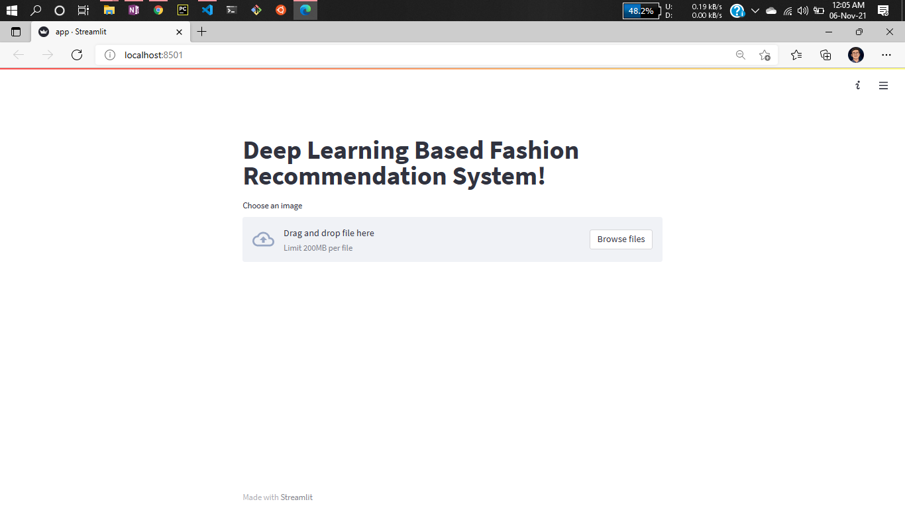
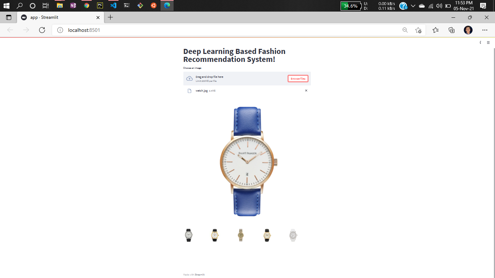
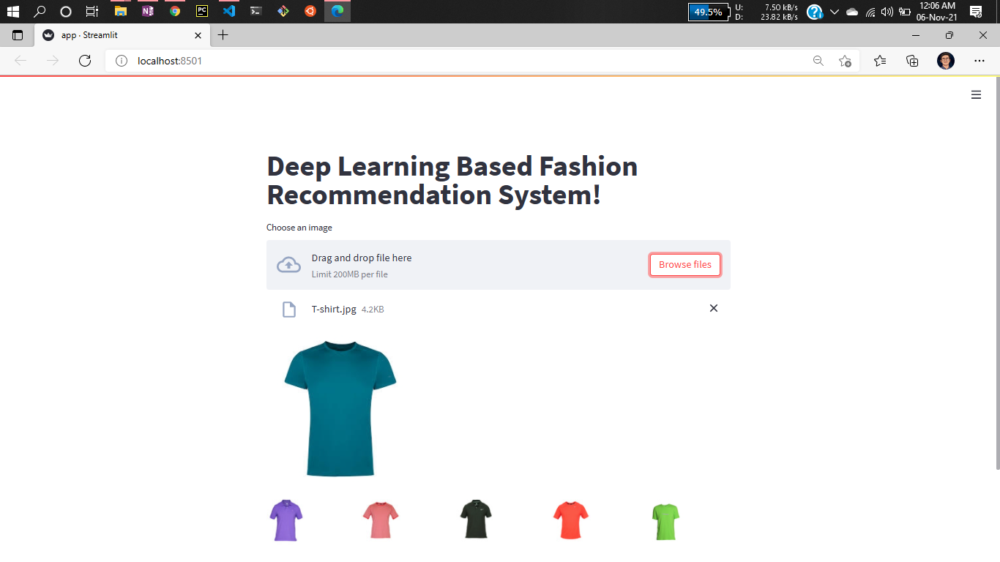
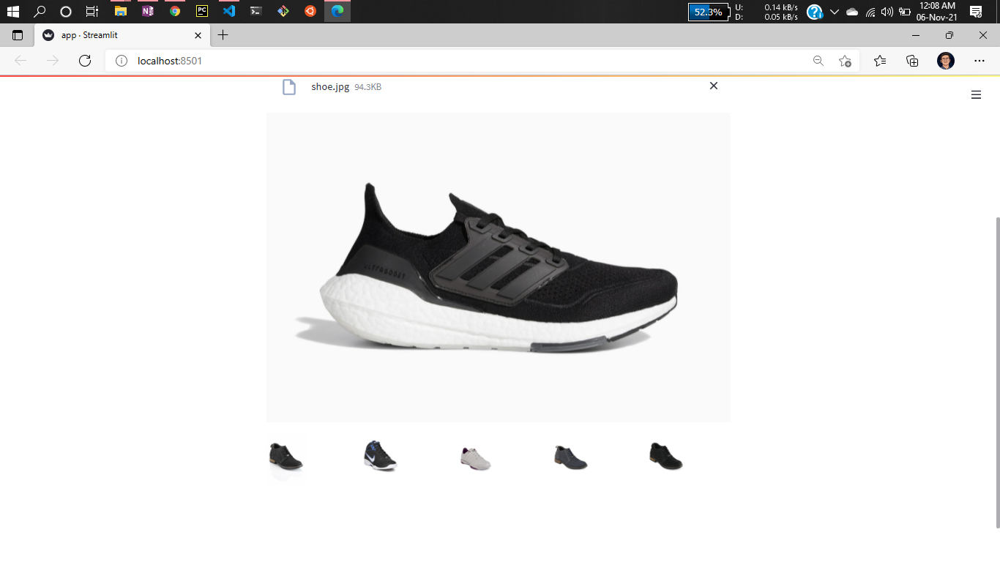
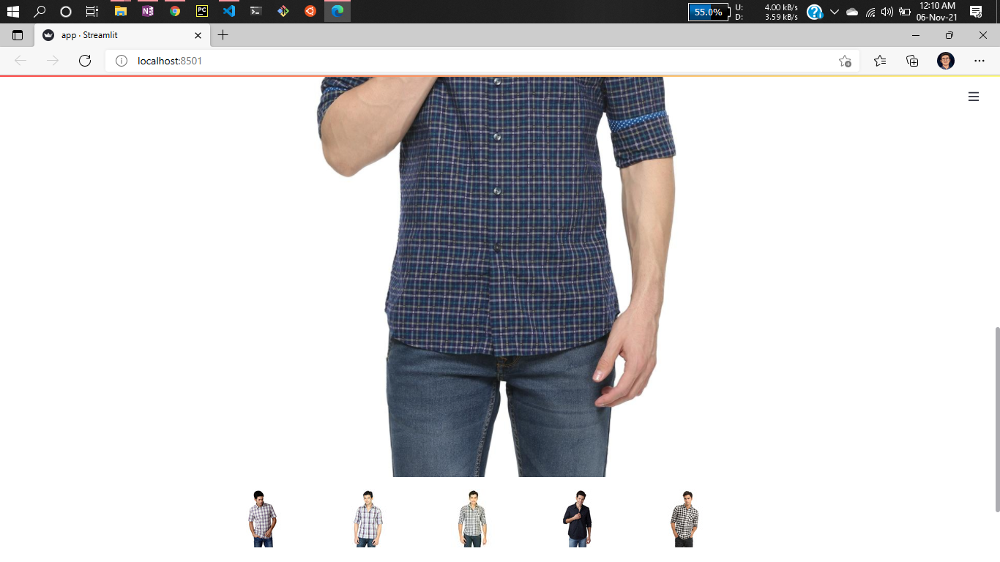
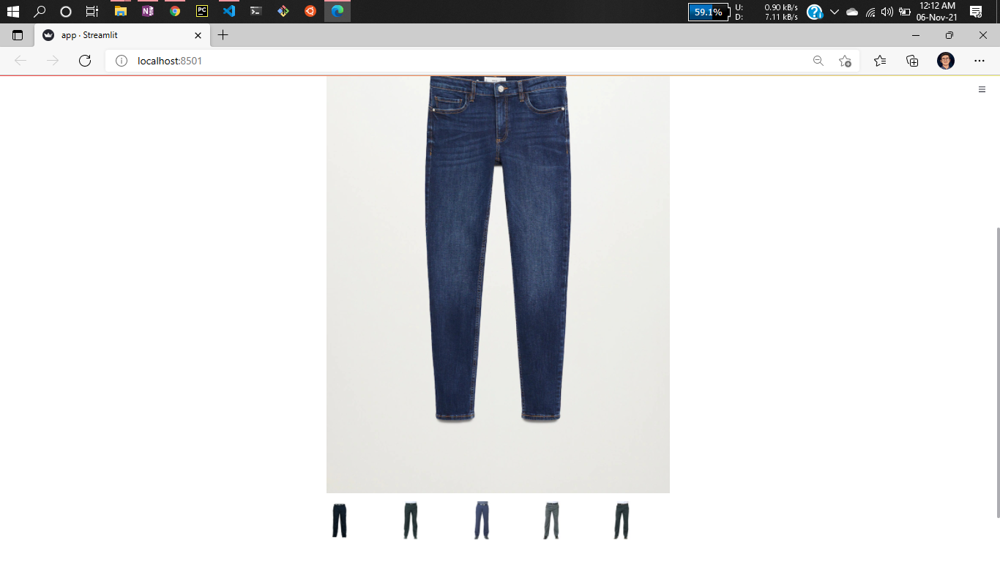

# Project Name: Fasion Recommendation System for Ecommerce

A Deep learning based streamlit web app which can recommened you various types of fasion products with respect to your choices.


## Original repo:

 - [Project Repo link](https://github.com/entbappy/)


## Demo Video:

 - [Demo video link](https://www.youtube.com/)


This is a methods of identifying similar products check various aspects on pictures, including: shape, colors, edges, features (including the lighting of the photo) and euclidean distance of vectors in n dim features space.

# Dataset has beem used:

 - [High Resolution Dataset link](https://www.kaggle.com/paramaggarwal/fashion-product-images-dataset)
 - [Low Resolution Dataset link](https://www.kaggle.com/paramaggarwal/fashion-product-images-small)


# Some Real Time Demo:

Web app look



Lets check some of images





This really performing good you can consider by seeing this result 😀








# STEPS to run this project:

You can also use others images

## STEP 01: 
Clone the repository

```bash
git clone https://github.com/entbappy/
```

## STEP 02: 
Create an environment


```bash
conda create -n fasion python=3.7 -y
```

## STEP 03: 
Install the requirements


```bash
pip install -r requirements.txt
```

## STEP 04: 
Download the data from the link and keep it in your project directory. Make sure all the images should be in just one folder called data, like that


## STEP 05: 
Just execute this command one time if you are not changing the data


```bash
python run.py
```

## STEP 06: 
Now to start the webapp run the following command


```bash
streamlit run app.py
```

yes!! Now you can start predicting 🙂

# Authors:
```bash
Author: Bappy Ahmed
Data Scientist
Email: entbappy73@gmail.com
```


